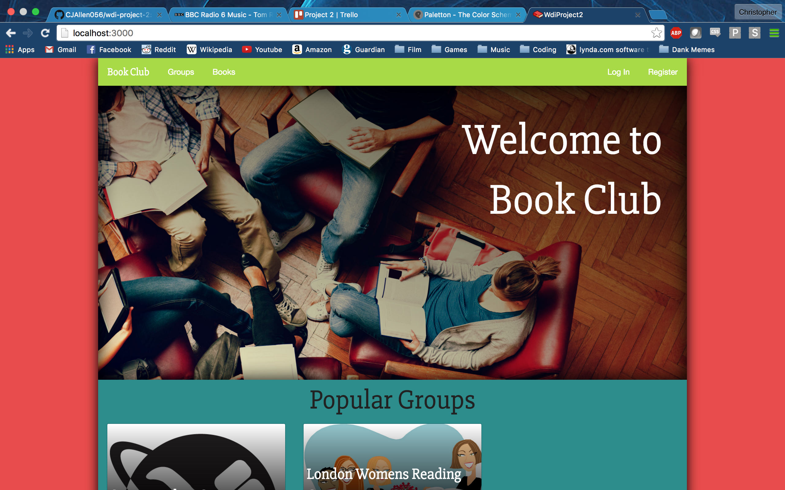

# WDI-project-2 – Book Club
Book Club was the second project built as part of the WDI course at General Assembly London.

### Brief and idea
The brief for the project was to build an app using Rails 

### Planning
